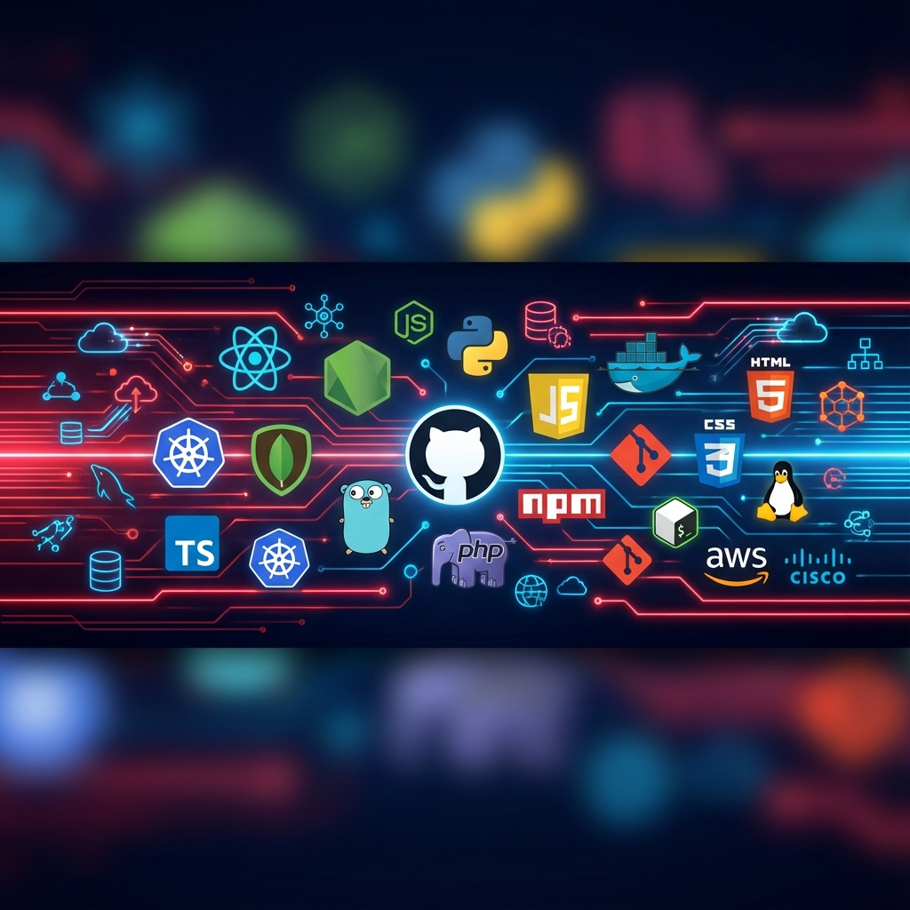

# Hello 👋 I'm Mohamed GHILLY

👨‍🎓 Student in **Network Engineering and Telecommunications** (ISCAE-Mauritania)  
🌐 Passionate about **Web/Mobile development**, **systems programming**, and **network administration and supervision**.  
🎯 Continuously learning **modern technologies**, **cybersecurity**, and **distributed systems**.

  

  

 

<!-- About Me Section -->

  <h2>📖 About Me</h2>

I am a <b>dedicated and ambitious student</b> pursuing a degree in <b>Network Engineering</b> and <b>Full Stack Development</b>. 
My journey into technology was driven by a fascination with how data travels across the globe and a passion for creating 
seamless digital experiences. I thrive on solving complex problems, whether it's configuring a secure network or developing 
a feature-rich web application. My goal is to leverage my dual expertise to contribute to innovative projects that push 
the boundaries of technology.

 

  

 

<!-- Technical Skills Section -->

  <h2>🛠️ Technical Skills</h2>
  
<i>My ever-growing toolkit for building digital solutions</i>

 

<table align="center">
  <tr>
    <td align="center" width="50%">
      <h3>🌐 Networks & Infrastructure</h3>
    </td>
    <td align="center" width="50%">
      <h3>💻 Development & DevOps</h3>
    </td>
  </tr>
  <tr>
    <td align="center">
      
      
       
      
      
       
      
      
       
      
    </td>
    <td align="center">
      
      
       
      
      
       
      
      
       
      
      
    </td>
  </tr>
</table>

 

  

 

<!-- Featured Projects Section -->

  <h2>🚀 Featured Projects</h2>
  
<i>A selection of projects that showcase my skills and passion</i>

 

<table align="center">
  <tr>
    <td align="center" width="33%">
      
      <h3>University Library System</h3>
      

        A comprehensive PHP-based library management system for universities, featuring book administration, 
        user management, and borrowing operations.
      

      

        
        
      

      
    </td>
    <td align="center" width="33%">
      
      <h3>Cloud Infrastructure</h3>
      

        Upcoming project focused on AWS cloud architecture and infrastructure design with container orchestration.
      

      

          
        
      

      
    </td>
    <td align="center" width="33%">
      
      <h3>Network Monitoring</h3>
      

        Network monitoring and automation solution for enterprise infrastructure management.
      

      

        
        
      

      
    </td>
  </tr>
</table>

 

  

 

<!-- GitHub Stats Section -->

  <h2>📊 My GitHub Activity</h2>

 

  
  

  

 

  

 

<!-- Currently Learning Section -->

  <h2>📚 Currently Learning</h2>

 

<table align="center">
  <tr>
    <td align="center" width="33%">
      <h3>🚀 Kubernetes</h3>
      
Container orchestration and deployment strategies for scalable applications

    </td>
    <td align="center" width="33%">
      <h3>☁️ AWS Certification</h3>
      
Cloud infrastructure and services mastery for solutions architect role

    </td>
    <td align="center" width="33%">
      <h3>🔐 Network Security</h3>
      
Advanced cybersecurity and penetration testing techniques

    </td>
  </tr>
</table>

 

  

 

<!-- Contact Section -->

  <h2>📬 Get In Touch</h2>
  
  

    I'm currently <b>available for freelance work</b> and open to discussing new projects. 
    Let's build something great together!
  

  
   
  
  
  
    

 

---

  <h3>💡 <i>"Building the future, one network packet and one line of code at a time"</i></h3>
  
   
  
  
<b>© 2025 Mohamed GHILLY</b> • All rights reserved

  
   

  

